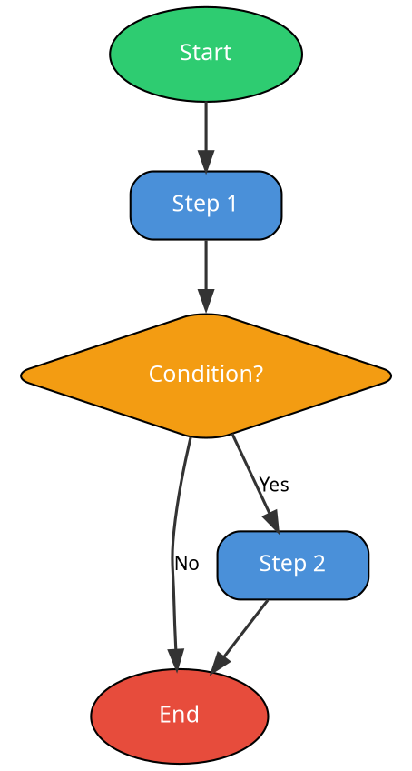

# Flowchart Generator

Generate professional flowcharts and diagrams from natural language descriptions. Converts the user's description into Graphviz DOT syntax, renders to PNG, and returns the image path.

## Prerequisites
- Graphviz must be installed and `dot` must be on PATH
- If `dot` is not found, tell the user to run: `choco install graphviz -y`

## How to Generate the DOT Code

### Flowchart/Process Flow


### Decision Tree
Use diamond shapes for decisions, box for outcomes. Use `label` on edges for Yes/No/conditions.

### Org Chart
Use `rankdir=TB` (top to bottom). Use box shapes. Group by rank with `{rank=same; node1; node2;}`.

### Sequence/Timeline
Use `rankdir=LR` (left to right) for horizontal flows.

## Color Palette (Professional, Dark-Mode Friendly)
- Process steps: `#4A90D9` (blue)
- Decisions: `#F39C12` (amber)
- Start: `#2ECC71` (green)
- End/Error: `#E74C3C` (red)
- Success/Complete: `#27AE60` (dark green)
- Warning/Caution: `#E67E22` (orange)
- Info/Note: `#9B59B6` (purple)
- Background: `#1E1E1E` (dark, optional)
- Subgraph fill: `#2D2D2D` (slightly lighter dark)

## Steps

1. **Parse the user's description** into a logical flow:
   - Identify start/end points
   - Identify process steps
   - Identify decision points (if/then/else)
   - Identify parallel paths or subgroups
   - Identify the direction (top-to-bottom is default, left-to-right for timelines)

2. **Generate DOT code** following the templates above:
   - Use descriptive but concise node labels
   - Use the color palette for visual distinction
   - Add edge labels for decision branches (Yes/No, conditions)
   - Group related nodes with subgraphs if there are distinct phases
   - Keep it clean. Fewer nodes with clear labels beats many nodes with clutter.

3. **Write the DOT file** to a temp location:
   - Path: `C:\Users\Derek DiCamillo\Projects\atlas\data\temp\flowchart.dot`
   - Create the `data\temp\` directory if it doesn't exist

4. **Render to PNG** using Graphviz (use absolute path to dot.exe):
   ```
   & "C:\Program Files\Graphviz\bin\dot.exe" -Tpng "C:\Users\Derek DiCamillo\Projects\atlas\data\temp\flowchart.dot" -o "C:\Users\Derek DiCamillo\Projects\atlas\data\temp\flowchart.png" -Gdpi=150
   ```
   - Use `-Gdpi=150` for crisp output on mobile (Telegram)
   - If the diagram is very wide, consider `-Gdpi=120` to keep file size reasonable

5. **Verify the PNG was created** and report the file path to the user.

6. **Show the image** by reading it with the Read tool so the user can see it inline.

7. **Clean up**: Leave the files in data/temp/ (they'll be overwritten next time). Don't delete them since the relay may need to send them.

## Diagram Types Supported
- **Flowchart** (default): Process flows with decisions
- **Decision tree**: Branching logic with outcomes
- **Org chart**: Hierarchical structure
- **Process map**: Multi-phase workflows with swimlanes (subgraphs)
- **State diagram**: States with transitions
- **Network/architecture diagram**: Components with connections
- **Timeline**: Left-to-right sequential events

## Tips for Quality Output
- Max ~15-20 nodes per diagram. If more, break into multiple diagrams.
- Use subgraphs to group phases: `subgraph cluster_phase1 { label="Phase 1"; ... }`
- For swimlanes, use horizontal subgraphs with `rank=same`
- Edge labels should be very short (1-3 words)
- Node labels should be action-oriented ("Review Application" not "The application is reviewed")

## Troubleshooting

### Error: dot.exe not found
Graphviz isn't installed. Run: `choco install graphviz -y` then restart the shell. Verify with: `& "C:\Program Files\Graphviz\bin\dot.exe" -V`

### Error: syntax error in DOT file
Common causes:
- Missing semicolons after node/edge definitions
- Unescaped quotes in labels (use `\"` or single quotes)
- Missing closing braces for subgraphs
Fix: Read the DOT file, identify the syntax error, correct, and re-render.

### PNG is blank or tiny
- Check that nodes actually have edges connecting them
- Verify `rankdir` is set correctly (TB for vertical, LR for horizontal)
- Try removing `bgcolor` if the background blends with node colors

### PNG is too large for Telegram
- Reduce DPI from 150 to 120: `-Gdpi=120`
- Break complex diagrams into multiple smaller ones
- Simplify labels (shorter text = smaller nodes)

### Graphviz crashes on complex graphs
- Reduce node count (aim for under 20)
- Remove circular references if possible
- Try `neato` or `fdp` layout engine instead of `dot` for network-style graphs
